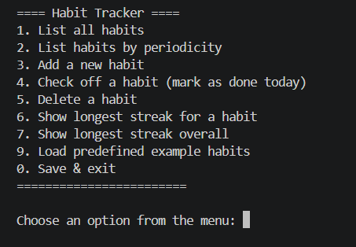
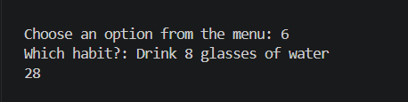
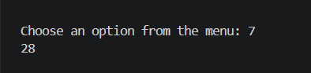
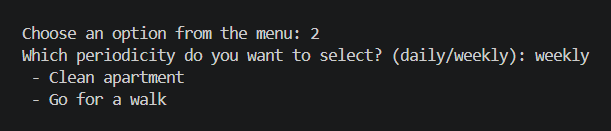
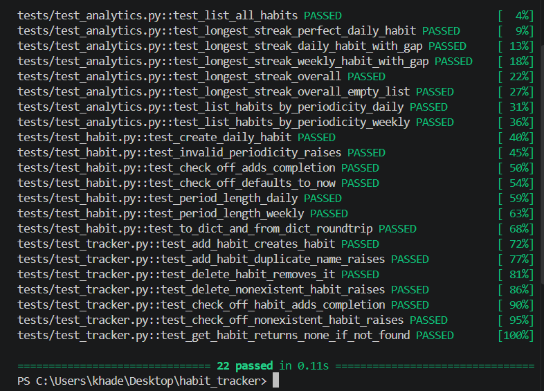

# Habit Tracker

A command-line habit tracking app built with Python, using object-oriented programming for the data model and functional programming for analytics.

## Features
- Create daily or weekly habits
- Check off habits as completed
- Data persists between sessions (JSON file storage)
- Analytics: list all habits, list by periodicity, longest streak for a habit, longest streak overall
- 5 predefined habits with 4 weeks of example data included

## Requirements
- Python 3.7+
- pytest (only needed to run the tests)

## Installation
1. Clone this repository and `cd` into it.
2. Install pytest: `pip install pytest`

## Running the app
```
python main.py
```
Choose option 9 first to load example habits, then explore the menu.
Option 0 saves your data and exits (stored in `data/habits.json`).

## Running the tests
```
python -m pytest tests/ -v
```
## Screenshots

### Running the app


### Analytics: longest streak for a specific habit


### Analytics: longest streak overall


### Analytics: filter by periodicity


### Test suite passing


## Project structure
- `habit.py` – the `Habit` class (OOP core)
- `tracker.py` – `HabitTracker`, manages the collection of habits
- `storage.py` – JSON save/load
- `analytics.py` – functional-programming analytics
- `predefined_data.py` – 5 example habits, 4 weeks of history
- `cli.py` / `main.py` – the interactive menu and entry point
- `tests/` – pytest suite